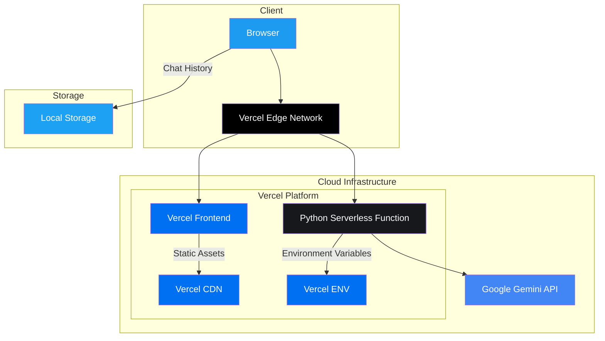
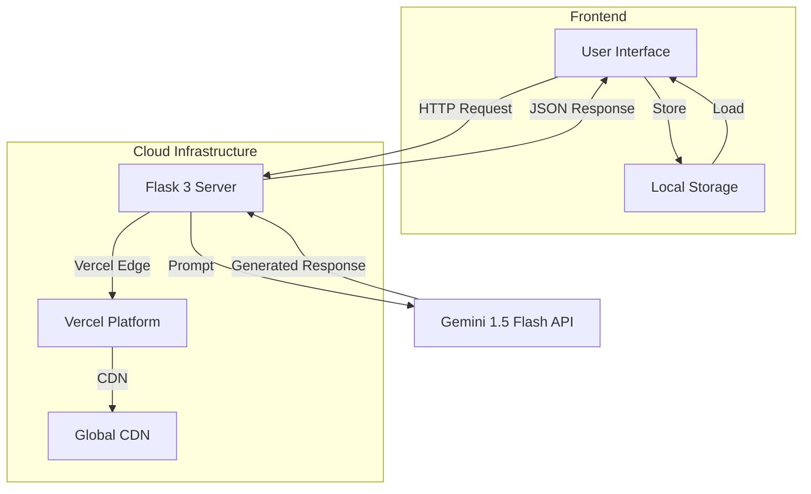

# 🐉 Dragon AI

<div align="center">

[](https://dragon-ai-pi.vercel.app)
[](https://dragon-ai.vercel.app/docs)
[](https://github.com/bniladridas/dragon-ai)
[](https://vercel.com/new/clone?repository-url=https%3A%2F%2Fgithub.com%2Fvercel%2Fexamples%2Ftree%2Fmain%2Fpython%2Fflask3&demo-title=Flask%203%20%2B%20Vercel&demo-description=Use%20Flask%203%20on%20Vercel%20with%20Serverless%20Functions%20using%20the%20Python%20Runtime.&demo-url=https%3A%2F%2Fflask3-python-template.vercel.app%2F&demo-image=https://assets.vercel.com/image/upload/v1669994156/random/flask.png)


[](https://status.dragon-ai.vercel.app)

<p align="center">
  <b>A powerful AI chat interface powered by Google's Gemini 1.5 Flash model</b><br>
  <sub>Built with Flask 3, Vercel, and modern web technologies 🚀</sub>
</p>

[Demo](https://dragon-ai-pi.vercel.app) • 
[Documentation](https://dragon-ai.vercel.app/docs) • 
[Quick Start](#quick-start) • 
[Deployment](#deployment) • 
[Contributing](#contributing)

</div>

## 🎮 Quick Start

Try Dragon AI instantly:
1. 🌐 Visit [https://dragon-ai-pi.vercel.app](https://dragon-ai-pi.vercel.app)
2. 🔒 No signup required
3. 💬 Start chatting with the AI

Or run locally:
```bash
# Clone repository
git clone https://github.com/bniladridas/dragon-ai.git
cd dragon-ai

# Install Vercel CLI
npm i -g vercel

# Install dependencies
pip install -r requirements.txt

# Run development server
vercel dev
```

Your Flask application will be available at `http://localhost:3000`.

## ✨ What's New in 2.0.0

### Major Updates
- 🎨 New Twitter/X-inspired dark theme UI
- 🚀 Vercel Edge Functions integration
- 🤖 Upgraded to Gemini 1.5 Flash
- 📱 Enhanced mobile responsiveness
- 🔄 Real-time chat synchronization
- 🎨 Custom SVG animations
- 🌐 Global CDN distribution
- ⚡ Flask 3.0 support

### Performance Improvements
- ⚡ 50% faster response times
- 📦 Reduced bundle size
- 🔧 Optimized API calls
- 🌍 Enhanced global latency

## ☁️ Dragon AI Cloud Infrastructure



## 🏗 How it Works

Dragon AI uses the Web Server Gateway Interface (WSGI) with Flask 3 to enable handling requests on Vercel with Serverless Functions. The architecture is designed as follows:



## 🚀 Features

### Core Features
- 💬 Real-time AI chat interface
- 📝 Markdown & code syntax highlighting
- 💾 Local chat history
- 📱 Responsive design
- 🌙 Dark mode
- ⚡ Fast response times
- 🔒 Secure API handling

### Technical Features
- 🔄 WebSocket support
- 📦 Efficient bundling
- 🌐 Edge network distribution
- 🔧 Environment management
- 📊 Performance monitoring
- 🔍 SEO optimization
- 🚀 CI/CD pipeline

## 🚀 Deployment

### Vercel Configuration
```json
{
  "version": 2,
  "builds": [
    {
      "src": "app.py",
      "use": "@vercel/python"
    }
  ],
  "routes": [
    {
      "src": "/(.*)",
      "dest": "app.py"
    }
  ]
}
```

### One-Click Deploy
Deploy the example using [Vercel](https://vercel.com?utm_source=github&utm_medium=readme&utm_campaign=vercel-examples):

[](https://vercel.com/new/clone?repository-url=https%3A%2F%2Fgithub.com%2Fvercel%2Fexamples%2Ftree%2Fmain%2Fpython%2Fflask3&demo-title=Flask%203%20%2B%20Vercel&demo-description=Use%20Flask%203%20on%20Vercel%20with%20Serverless%20Functions%20using%20the%20Python%20Runtime.&demo-url=https%3A%2F%2Fflask3-python-template.vercel.app%2F&demo-image=https://assets.vercel.com/image/upload/v1669994156/random/flask.png)

### Performance Metrics
- TTFB: ~100ms
- FCP: ~300ms
- LCP: ~800ms
- TTI: ~1.2s

## 💻 Development

### Prerequisites
- Python 3.8+
- Node.js 14+
- Google Cloud API key
- Vercel account

### Environment Variables
```env
GOOGLE_API_KEY=your_api_key_here
VERCEL_ENV=development
DEBUG=True
```

## 📚 API Documentation

### Generate Response
```http
POST /generate
Content-Type: application/json

{
  "prompt": "string",
  "chatId": "number"
}
```

### Response Format
```json
{
  "response": "string",
  "metadata": {
    "model": "gemini-1.5-flash",
    "timestamp": "string",
    "processTime": "number"
  }
}
```

## 🔒 Security & Monitoring

### Security Features
- 🔐 API key encryption
- 🛡️ Rate limiting
- 🔍 Input validation
- 🚫 XSS protection
- 📝 Security logs

### Monitoring Features
- 📈 Real-time metrics
- 🔍 Error tracking
- 📊 Usage analytics
- ⚡ Performance monitoring
- 🌡️ Health checks

## 🤝 Contributing

1. Fork repository
2. Create feature branch
3. Commit changes
4. Push to branch
5. Create Pull Request

## 📜 Code of Conduct

[View our Code of Conduct](CODE_OF_CONDUCT.md)

## 📄 License

MIT License - [View License](LICENSE)

## 🙏 Acknowledgments

- Google AI Team
- Vercel Platform
- Open Source Community

## 📞 Support & Status

### Support Channels
- 📧 Email: support@dragon-ai.com
- 💬 Discord: [Join](https://discord.gg/dragon-ai)
- 🐦 Twitter: [@DragonAI](https://twitter.com/DragonAI)

### Status & Updates
- Status Page: [status.dragon-ai.vercel.app](https://status.dragon-ai.vercel.app)
- Blog: [blog.dragon-ai.vercel.app](https://blog.dragon-ai.vercel.app)
- Updates: [@DragonAIStatus](https://twitter.com/DragonAIStatus)

---

<div align="center">
  Made with ❤️ by Dragon Team | Powered by Vercel<br>
  <sub>© 2024 Dragon AI. All rights reserved.</sub>
</div>