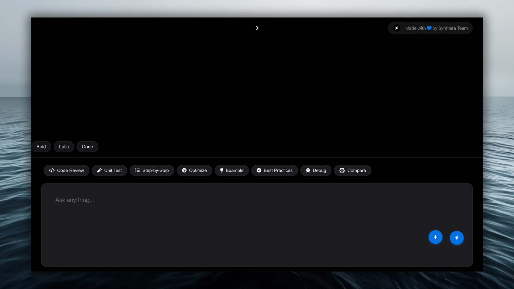

# Synthara - AI Chat Interface



A web-based chat interface powered by Flask and Google Gemini, designed for interactive AI conversations.

## Tech Specs

*   **Backend Framework:** [Flask](https://flask.palletsprojects.com/)
*   **Programming Language:** [Python 3](https://www.python.org/)
*   **AI Model Integration:** [Google Generative AI SDK for Python](https://github.com/google/generative-ai-python) (`google-generativeai`) using Gemini (`gemini-2.5-pro-exp-03-25`).
*   **Environment Variable Management:** [python-dotenv](https://github.com/theskumar/python-dotenv)
*   **Frontend:** HTML, CSS, JavaScript (with Marked.js for Markdown and Highlight.js for code syntax).
*   **Deployment:** Configured for [Vercel](https://vercel.com/).
*   **API Endpoint:** `/generate` (POST)
*   **Data Format:** JSON

## Project Structure

```
├── app.py # Flask application
├── index.html # Frontend HTML file
├── requirements.txt # Python dependencies
├── vercel.json # Vercel deployment configuration
├── .env.example # Example environment file
├── .gitignore # Git ignore rules
└── README.md # This file
```

## Tech Specs

This application utilizes the following core technologies:

*   **Backend Framework:** [Flask](https://flask.palletsprojects.com/) - A lightweight WSGI web application framework in Python used to build the web server and API endpoints.
*   **Programming Language:** [Python 3](https://www.python.org/)
*   **AI Model Integration:** [Google Generative AI SDK for Python](https://github.com/google/generative-ai-python) (`google-generativeai`) - Used to interact with Google's Generative AI models (specifically configured for the experimental Gemini model `gemini-2.5-pro-exp-03-25`).
*   **Environment Variable Management:** [python-dotenv](https://github.com/theskumar/python-dotenv) - Used to load environment variables (like API keys) from a `.env` file into the application's environment.
*   **API Endpoint:**
    *   `/generate` (POST): Accepts a JSON payload with a `prompt` key and returns a JSON response containing the AI-generated text or a predefined response.
*   **Frontend Serving:** Flask's built-in static file serving (`send_from_directory`) is used to serve the main `index.html` file (expected to be in the parent directory `../`).
*   **Data Format:** JSON is used for communication between the frontend and the backend API endpoint (`/generate`).
*   **Standard Libraries:** Uses Python's built-in `os` (for environment variables/paths) and `logging` modules.


## Prerequisites

*   Python 3.8+
*   pip & virtualenv
*   Git
*   A Google API Key with Gemini API enabled.
*   A Vercel account.

## Local Setup

1.  **Clone the repository:**
    ```bash
    git clone https://github.com/bniladridas/synthara-ai.git
    cd synthara-ai
    ```
2.  **Create and activate a virtual environment:**
    ```bash
    python -m venv venv
    source venv/bin/activate  # On Windows use `venv\Scripts\activate`
    ```
3.  **Install dependencies:**
    ```bash
    pip install -r requirements.txt
    ```
4.  **Set up environment variables:**
    *   Rename `.env.example` to `.env`.
    *   Open `.env` and add your Google API Key:
        ```env
        GOOGLE_API_KEY=YOUR_GOOGLE_API_KEY_HERE
        ```
5.  **Run the application:**
    ```bash
    python3 api/index.py 
    ```
    Access the application at `http://127.0.0.1:5001`.

## Deployment to Vercel

1. **Push your code to a Git repository** (GitHub, GitLab, Bitbucket)
   * Ensure `api/index.py`, `index.html`, `requirements.txt`, and `vercel.json` are committed

2. **Log in to your Vercel account**

3. Click **"Add New..."** → **"Project"**

4. **Import** your Git repository

5. **Configure Project:**
   * **Project Name:** `Synthara` (or your choice)
   * **Framework Preset:** Vercel should automatically detect **"Python"** or **"Flask"** based on `requirements.txt` and `vercel.json`. If not, select **"Other"**
   * **Build & Development Settings:** Vercel usually infers correctly from `vercel.json` and `requirements.txt`. Ensure the install command is `pip install -r requirements.txt`

6. **Environment Variables:**
   * Navigate to the **"Environment Variables"** section
   * Add your Google API Key:
     * **Name:** `GOOGLE_API_KEY`
     * **Value:** `YOUR_GOOGLE_API_KEY_HERE`
   * Ensure the variable is available for all environments (Production, Preview, Development)

7. Click **"Deploy"**

8. Vercel will build and deploy your application. Once done, you'll get a public URL

## Future Enhancements

* Add more robust error handling
* Implement chat session persistence beyond local storage
* Refine the UI/UX

## Testing & Verification

Here are recommended test prompts to verify Synthara's capabilities and behaviors:

### Test Categories

1. **Identity & Capabilities Check**
   - Ask about Synthara's purpose and features
   - Verify knowledge about its technical stack
   - Test understanding of its limitations

2. **Code-Related Prompts**
   - Request code examples in different languages
   - Ask for code explanations
   - Debug sample code issues

3. **Technical Explanations**
   - Request explanations of technical concepts
   - Ask about software development practices
   - Inquire about architectural patterns

4. **Mixed Format Responses**
   - Prompts requiring code, text, and lists
   - Questions needing diagrams or tables
   - Multi-part technical explanations

5. **Edge Cases**
   - Very long prompts
   - Multi-language code requests
   - Complex technical scenarios

6. **Project-Specific**
   - Questions about Flask implementation
   - Google Gemini API integration
   - Frontend-backend interaction

7. **Code Review Scenarios**
   - Code improvement suggestions
   - Best practices review
   - Performance optimization tips

8. **Complex Technical Discussions**
   - System architecture discussions
   - Technology stack comparisons
   - Implementation trade-offs

### Verification Checklist

Ensure Synthara:
- [ ] Maintains consistent identity
- [ ] Uses proper markdown formatting
- [ ] Provides syntax-highlighted code
- [ ] Gives technically accurate responses
- [ ] Keeps a professional yet friendly tone
- [ ] Handles complex technical discussions
- [ ] Properly formats long responses
- [ ] Stays within its defined capabilities

### Example Test Prompts

```python
# Test prompt examples:

1. "Explain how Flask routes work and provide an example."
2. "Review this code snippet for best practices:
    def process_data(data):
        return [x*2 for x in data if x > 0]"
3. "Compare REST and GraphQL with code examples."
4. "Explain the benefits of using environment variables in Python."
```

### Response Quality Metrics

- Code formatting: Proper syntax highlighting and indentation
- Technical accuracy: Correct and current information
- Clarity: Well-structured and easy to understand
- Completeness: Thorough coverage of the topic
- Consistency: Maintains defined persona and capabilities
